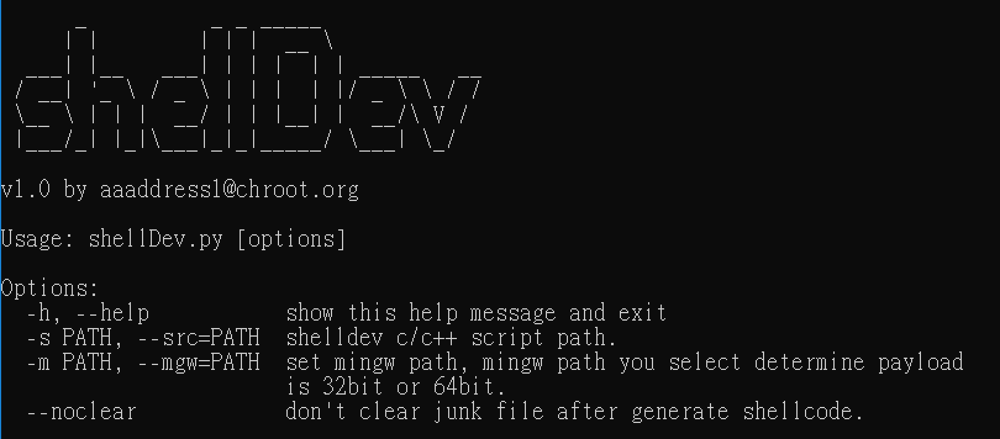

## shellDev.py

A simple python script for building windows 32bit/64bit shellcode in C.

以 C 語言快速開發支持 Windows 32/64 位元的 Shellcode 之 Python 腳本。

## Preinstall（前置安裝）
* Python 2.7 <https://www.python.org/download/releases/2.7/>
* MinGW-w64 <https://sourceforge.net/projects/mingw-w64/>

## Demo（簡單展示）

[](https://www.youtube.com/watch?v=4-M6abqaV3c)

Building 32bit Windows shellcode:
`> python shellDev.py -m C:\MinGW\mingw32\ -s msg.cpp --jit32`

Building 62bit Windows shellcode:
`> python shellDev.py -m C:\MinGW\mingw64\ -s msg.cpp --jit64`


## shellDev.py Quickly Start 

demo.cpp（shellDev 腳本範例）

```cpp
/* Beep & Alert.
 * by aaaddress1@chroot.org
 */
#include <shellDev>

void shellFunc shellEntry(void) {
    PVOID addr;

	fetchAPI(msgbox, MessageBoxA);
	fetchAPI(bp, Beep);

	bp(100, 100);
	msgbox(0, "hello", "word", 0);
}
```
Using function `fetchAPI(defineAPI, ApiName)` to define a Win32 API as a new function you want. By this method, it's a easier to call any Win32 API. `fetchAPI` lookup targeted Win32 API in loaded modules, and mark it as new function you like.

可以透過函數 `fetchAPI(defineAPI, ApiName)` 將指定的 Win32 系統 API 定義為一個你想使用的函數名. 透過此功能你可以很輕易的自動模糊搜尋記憶體已知的系統 Win32 API 並且以你想要的函數名調用.

## Advanced Example

msg.cpp（shellDev 腳本範例）

```cpp
#include <shellDev>

void shellFunc shellEntry(void) {
    PVOID addr;

    char knl32[] = "kernel32.dll";
    char ldLibastr[] = "LoadLibraryA";
    addr = getFuncAddr(getModAddr(knl32), ldLibastr);
    func<decltype(&LoadLibraryA)> loadLibA((FARPROC)addr);

    char usr32[] = "user32.dll";
    char msgboxastr[] = "MessageBoxA";
    addr = getFuncAddr(loadLibA(usr32), msgboxastr);
    func<decltype(&MessageBoxA)> msgbox((FARPROC)addr);

    char msg[] = "top-level message here!";
    char title[] = "you must know it!";
    msgbox(0, msg, title, 0);
}
```

you can easily get module memory address by `getModAddr()` (like windows api `GetModuleHandleA`) and get function address by `getFuncAddr()` (like windows api `GetProcAddress`). the foregoing example will be build in a large size shellcode (624 bytes), a better example:


可以透過我開發好的函數 `getModAddr()` 取得模組地址 (用法上類似 Windows API `GetModuleHandleA`) 、以 `getFuncAddr()` 取得函數地址 (用法上類似 Windows API `GetProcAddress`). 若以上述的例子保存為 msg.cpp 透過 shellDev.py 編譯會產生出長度較長的 Shellcode (624 bytes), 底下示範一個比較好的 shellDev 腳本寫法:

```cpp
#include <shellDev>

void shellFunc shellEntry(void) {
	PVOID addr;

	char usr32[] = "user32.dll";
	HMODULE knl32Mod = (HMODULE)getModAddrByHash(/* kernel32.dll */0xb40d1235);
	addr = getFuncAddrByHash(knl32Mod, /* LoadLibraryA */0xee383d4a);
	func<decltype(&LoadLibraryA)> loadLibA((FARPROC)addr);

	HMODULE usr32Mod = loadLibA(usr32); 
	addr = getFuncAddrByHash(usr32Mod, /* MessageBoxA */0xf63a44d0);
	func<decltype(&MessageBoxA)> msgbox((FARPROC)addr);

	char msg[] = "top-level message here!";
	char title[] = "you must know it!";
	msgbox(0, msg, title, 0);
}
```

using `getModAddrByHash()` and `getFuncAddrByHash()` instead of `getModAddr()` and `getFuncAddr()`, you can build smaller size shellcode (only 496 bytes). how to get hash of a text? you can use `modHash()` (defined in [shellDev.hpp](shellDev.hpp)) to get string hash.

使用 `getModAddrByHash()` 與 `getFuncAddrByHash()` 函數來取得函數地址與模組地址，減少使用 `getModAddr()`與 `getFuncAddr()` 函數, 你將可以取得較短的 Shellcode (only 496 bytes). 那麼雜湊值（Hash）如何取得呢？你可以透過內置的函數 `modHash()` (定義於 [shellDev.hpp](https://github.com/aaaddress1/shellDev.py/blob/master/shellDev.hpp) 內) 取得字串的雜湊結果.

e.g. 
* modHash("kernel32.dll") = 0xb40d1235
* modHash("LoadLibraryA") = 0xee383d4a
* modHash("MessageBoxA") = 0xf63a44d0

*modHash(wchar_t[]) or modHash(char[]) is case-insensitive.*

```cpp
#include <shellDev>

PVOID shellFunc getUsr32Mod() {
	PVOID knl32Mod = getModAddrByHash(/* kernel32.dll */0xb40d1235);
	PVOID addr = getFuncAddrByHash
	(
		(HMODULE)knl32Mod, 
		/* LoadLibraryA */0xee383d4a
	);
	func<decltype(&LoadLibraryA)> loadLibA((FARPROC)addr);

	char usr32[] = "user32.dll";
	PVOID usr32Mod = loadLibA(usr32); 
	return usr32Mod;
}
void shellFunc shellEntry(void) {
	PVOID addr = getFuncAddrByHash
	(
		(HMODULE)getUsr32Mod(),
		/* MessageBoxA */0xf63a44d0
	);
	func<decltype(&MessageBoxA)> msgbox((FARPROC)addr);

	char msg[] = "top-level message here!";
	char title[] = "you must know it!";
	msgbox(0, msg, title, 0);
}
```

you must define your own function in `shellFunc` calling convention if you want to declared a new function.

如果你有興趣自行額外設計函數在 Shellcode 內調用，務必記得自行設計的函數必須遵守 `shellFunc` 呼叫約制（如上例示範）

## Limitation（限制）

all variables should be defined as local variables, global variables will lead to crash. (the string parameters you pass to functions should be defined as local variables too)

因為定址方式問題，所以 shellDev 腳本不允許宣告任何全域變數、僅允許以區域變數存放資料，否則產出的 Shellcode 使用後必定會導致程式異常崩潰。即便是傳入給函數的文字常數，也務必先以區域變數保存，在傳遞給函數才能確保 Shellcode 正常運行。

## Contact

* Twitter @aaaddress1
* aaaddress1@chroot.org
* www.facebook.com/aaaddress1
